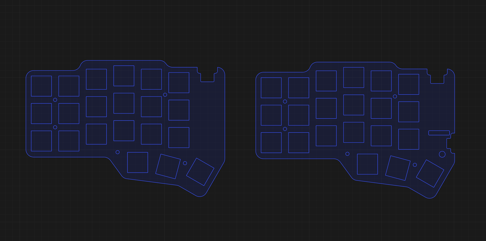

## BleCorne ZMK Firmware

This is my custom [ZMK](https://zmk.dev/) keymap config for the **low profile** Corne (3x6+3) wireless keyboard.


> [!TIP]
> 📸 Browse the **[keyboard build gallery](https://willacosta.github.io/zmk_bs_corne_firmware/gallery/)** for more photos of the build!

## Highlights of this build

- Wireless PCB from BoardSource
- Low-profile aluminum case (also from BoardSource)
- NuPhy low-profile nSA keycaps
- Gateron Low Profile 3.0 Blush Silent switches (they are incredible btw)
- Anodized aluminum top plates (manufactured through JLCCNC)

> I've posted about it on Reddit, [check it out](https://www.reddit.com/r/ErgoMechKeyboards/comments/1tvyr2r/comment/osqpd7x/?screen_view_count=2).


## Hardware Information

### Expansion Pinout

The 8-pin header on each side (identical, not mirrored) is read from left to right. These are perfect for screens (nice!view / e-ink) or custom hardware.

| Pin | GPIO | Note |
| --- | --- | --- |
| 1 | 0.07 |  |
| 2 | 0.21 |  |
| 3 | 0.12 |  |
| 4 | 0.23 |  |
| 5 | VCC | Switched via pin 0.31 |
| 6 | GND |  |
| 7 | 0.19 |  |
| 8 | 0.05 |  |

---

### Battery

I'm using a 601530 315mAh LiPo battery on each half. The keyboard lasts for over a month with constant usage. Note that I use some power saving config provided by ZMK:

```toml
CONFIG_ZMK_SLEEP=y
CONFIG_ZMK_IDLE_SLEEP_TIMEOUT=3600000 # Go to sleep after 1h
...
```

## Aluminum Plates

I've designed the top aluminum plates based on the original plate for the Unicorne which is open-source, but BoardSource doesn't provide the files for their SMT Wireless PCB. So I had to come up with the measurements by myself.



I've [open-sourced](https://github.com/WillACosta/boardsource-wireless-plate-files) the KiCad files, so you can try them if you own a BoardSource PCB.

> **Note that these plates are ONLY compatible with the BoardSource Unicorne case**, but you can of course use them with other cases if you modify the layout. I have tested them with a sandwich case and they worked well.

## Flashing instructions

- Fork this repository
- Go to the [ZMK Keymap Editor](https://nickcoutsos.github.io/keymap-editor/), connect your GitHub Account, then give permissions to the cloned repository.
- Save your layout, then go to the GitHub Actions tab and wait for the _firmware_ build process to finish.
- Download the `.zip` file and extract the files.

> You will notice that we have three files with the `.uf2` extension, we'll use them to flash the new firmware.

- Turn off the keyboard half, plug it in with the USB-C cable, and reset the keyboard by pressing the "reset button" twice, or use a pre-defined "&bootloader" behavior.
- The MCU will be recognized by the computer as an external drive, copy and paste the appropriate `.uf2` file to it, the device will disconnect automatically after the flashing process.
- Do the same thing to the other half.

> [!NOTE]
> Sometimes a message might be shown after flashing the keyboard with the `.uf2` files, but generally it can be ignored. This happens because the flash process finishes and the microcontroller unmounts automatically before the OS knows whether the process was successful. See the [troubleshooting section](https://v0-3-branch.zmk.dev/docs/troubleshooting/flashing-issues) of ZMK for details.

> If the halves do not communicate with each other after the flashing process, you may need to turn on the halves and press the "reset button" on both halves at the same time, so they can synchronize.

> For further information go to the [official documentation](https://v0-3-branch.zmk.dev/docs/user-setup#flashing-uf2-files) for ZMK.
