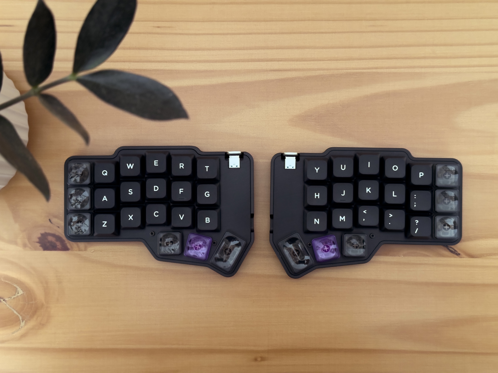
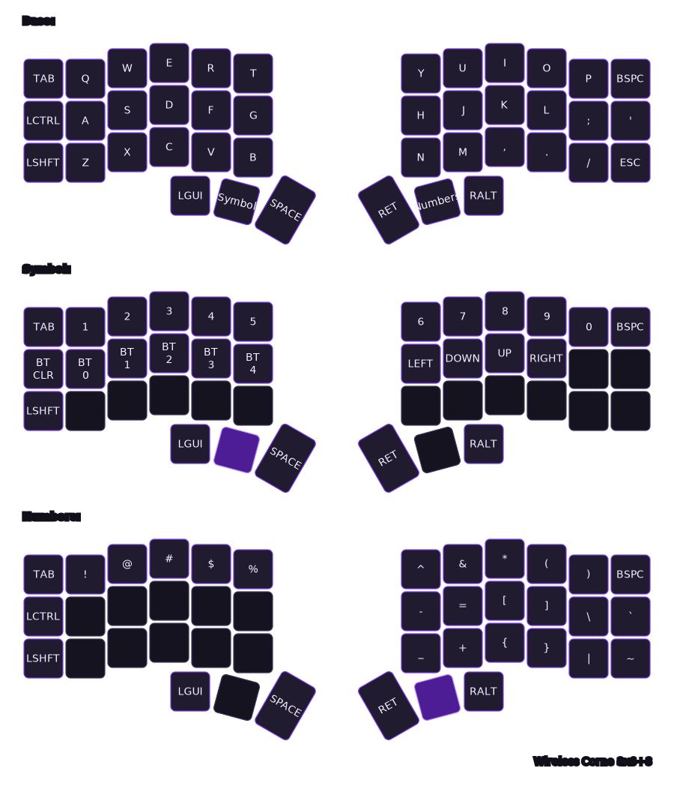

## BleCorne ZMK Firmware

This is my custom [ZMK](https://zmk.dev/) keymap config for the **low profile** Corne (3x6) wireless keyboard from the [Boardsource](https://boardsource.xyz/).

> [!TIP]
> 📸 Browse the **[keyboard build gallery](https://willacosta.github.io/wireless-corne_zmk_config/gallery/)** for more photos of the build!

## Highlights of this build

- Wireless PCB from BoardSource
- Low-profile aluminum case (also from BoardSource)
- NuPhy low-profile nSA keycaps
- Gateron Low Profile 3.0 Blush Silent switches (they are incredible btw)
- Anodized aluminum top plates (manufactured through JLCCNC)

> I've posted about it on Reddit, [check it out](https://www.reddit.com/r/ErgoMechKeyboards/comments/1tvyr2r/comment/osqpd7x/?screen_view_count=2).

## Hardware Information

### Expansion Pinout

The 8-pin header on each side (identical, not mirrored) is read from left to right. These are perfect for screens (nice!view / e-ink) or custom hardware.

| Pin | GPIO | Note |
| --- | --- | --- |
| 1 | 0.07 |  |
| 2 | 0.21 |  |
| 3 | 0.12 |  |
| 4 | 0.23 |  |
| 5 | VCC | Switched via pin 0.31 |
| 6 | GND |  |
| 7 | 0.19 |  |
| 8 | 0.05 |  |

---

### Battery

If shipping allows, batteries are included. The PCB features a micro JST connector (BM02B-ACHSS-GAN-ETF) and labeled solder pads (+/-) for custom installs.

**Max Dimensions:**

* **Choc:** 30x17x3mm
* **MX:** 30x17x6mm

## Flashing instructions

- Go to the [ZMK Keymap Editor](https://nickcoutsos.github.io/keymap-editor/), connect this repository and add the desired keys.
- Save the layout, after that go to the github actions tab and wait for the _firmware_ building process to finish.
- Download the `.zip` file and extract the files.

> You will notice that we have three files with the `.uf2` extension, we'll use them to flash the new firmware to halves.

- Turn off the keyboard halve, and plug it with the USB-C cable, reset the keyboard by pressing the "reset button" twice.
- After the controller will recognized by the computer as an external drive, copy and paste the appropriate `.uf2` file to it, the device will disconnect automatically after the flashing process.
- Do the same thing to the other halve.

> [!NOTE]
> Sometimes a message might be showed after flashing the keyboard with the `.uf2` files, but generally we can just ignore it, as it happens after the flash process finishes and the micro controller unmount automatically before the OS knowing if the process was successful, see the [troubleshooting section](https://v0-3-branch.zmk.dev/docs/troubleshooting/flashing-issues) of ZMK for details.

- Now you need to turn on the halves and press the "reset button" one time on each halve (at the same time), so that the parts can connect and communicate between each other.

> For further information go to the [official documentation](https://v0-3-branch.zmk.dev/docs/user-setup#flashing-uf2-files) for ZMK.
